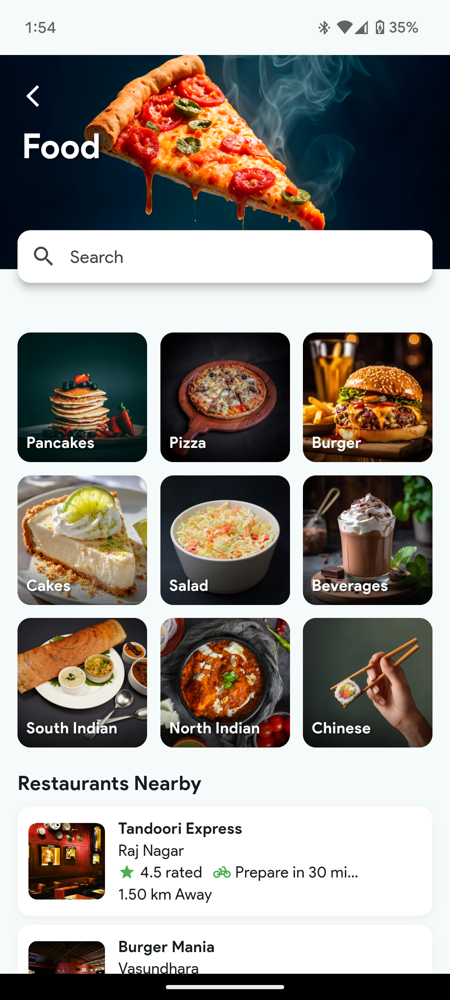
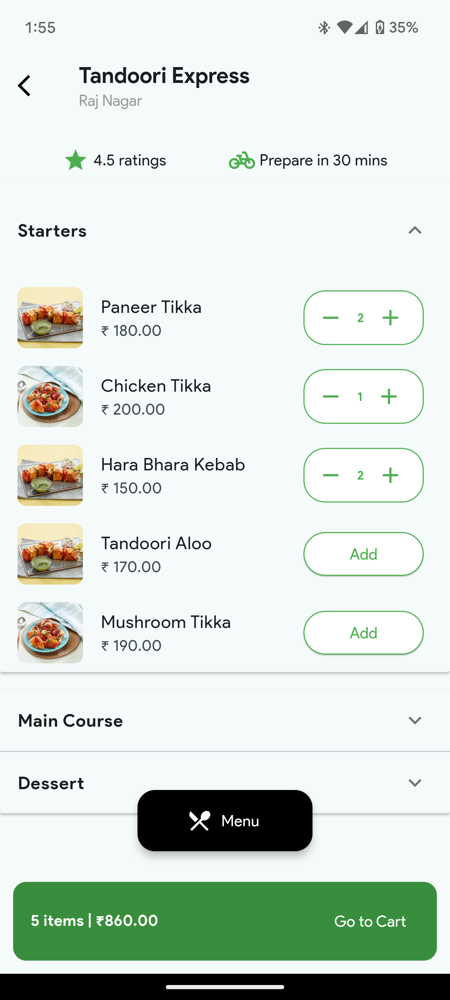

# Craving 🍔

**Craving** is a Flutter-based food delivery application that connects users with nearby restaurants, enabling them to browse food categories, explore vendors, and order food seamlessly.


## ✨ Features

* 📦 View curated food **categories**
* 🧑‍🍳 Explore **vendors** and restaurants
* 🍱 Browse available **products/menus**
* 🛒 Add food items to cart
* 💬 Smooth navigation with **Flutter BLoC**
* 💡 Clean and scalable folder structure

## 📱 Screens

* Home Screen
* Categories Screen
* Vendor/Product Listing Screen
* Product Details
* Cart Page
* Floating Menu Button with Restaurant Icon

## 🧠 State Management

We use **BLoC (Business Logic Component)** for scalable and testable state management.

```
lib/
│
├── blocs/
│   ├── category/
│   ├── vendor/
│   └── product/
│
├── models/
│   ├── category_model.dart
│   ├── vendor_model.dart
│   └── product_model.dart
│
├── screens/
├── widgets/
└── main.dart
```

## 🔧 Tech Stack

* Flutter 3.24
* Dart 3.3
* BLoC for state management
* Clean Architecture principles
* Material UI design

## 🚀 Getting Started

1. **Clone the repo**

   ```bash
   git clone https://github.com/DhruvChaurasia9403/Craving.git
   cd Craving
   ```

2. **Install dependencies**

   ```bash
   flutter pub get
   ```

3. **Run the app**

   ```bash
   flutter run
   ```

## 📂 Project Structure

```
craving-app/
│
├── lib/
│   ├── blocs/            # BLoC cubits and states
│   ├── models/           # Data models
│   ├── screens/          # UI screens
│   ├── widgets/          # Reusable widgets
│   └── main.dart         # Entry point
```

## 📱 Screens

### 1. 🏠 Home Page (Simple)



### 2. 🍽️ Product Screen




```

```

## 📦 APK Download

You can try out the app by downloading the latest APK from the [Releases](https://github.com/DhruvChaurasia9403/Craving) section.

```
https://drive.google.com/file/d/1zTDMaRwkJ701SIKEg78tlqukS0TbK1g1/view?usp=drivesdk
```

## ✅ TODO

* [x] Category-based product filtering
* [x] Vendor screen integration
* [ ] Implement order placing
* [ ] Add Firebase backend (optional)
* [ ] Add login/signup screen

## 🧑‍💻 Developed By

**Dhruv Chaurasia**
Flutter Developer | Android Developer
[GitHub](https://github.com/DhruvChaurasia9403)

## 📄 License

This project is licensed under the MIT License - see the [LICENSE](LICENSE) file for details.
